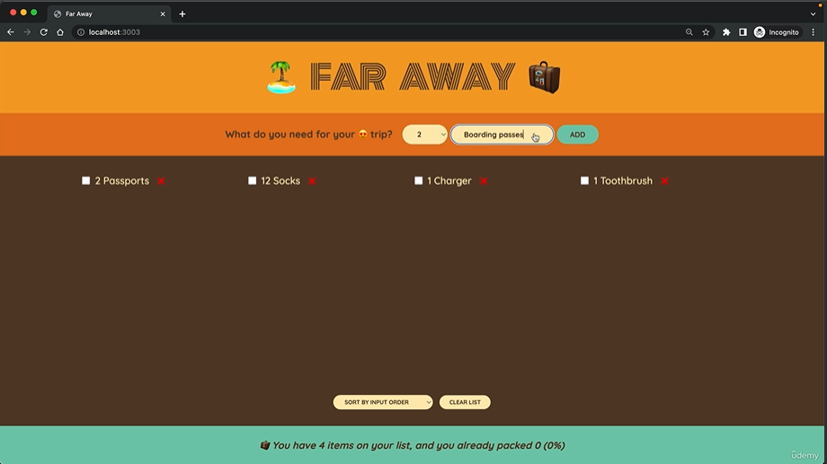

# 🌍✈️ Travel List

Project started: February 16, 2024

Welcome to Travel List, a React application designed to help you organize and plan your next travel adventures!

## Overview

Travel List is a simple yet powerful tool for creating and managing lists of ideas, destinations, and activities for your upcoming trips. Whether you're planning a weekend getaway or a long-term adventure, Travel List makes it easy to keep track of all the places you want to visit and the experiences you want to have.

## Installation

To get started with Travel List on your local machine, follow these steps:

1. Clone this repository to your local machine using `git clone`.
2. Navigate to the project directory.
3. Run `npm install` to install the necessary dependencies.
4. Run `npm start` to launch the application locally.

## Technologies Used

- React
- JavaScript (ES6+)
- HTML5
- CSS3
- npm

## Contributing

Contributions are welcome! If you find any bugs or have suggestions for new features, please submit an issue or create a pull request.
